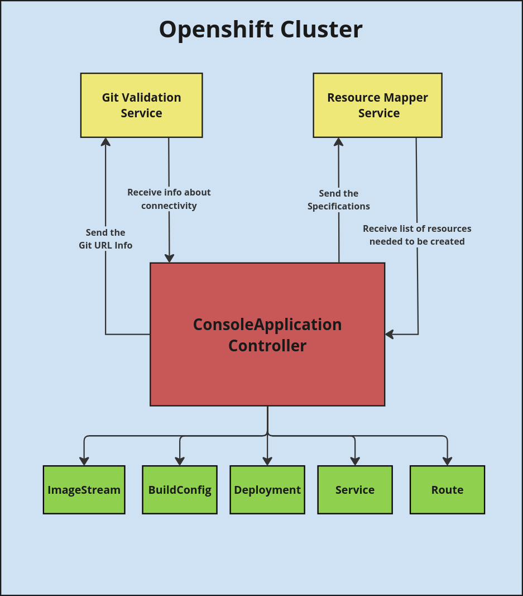

# ConsoleApplication Operator

**Note: For the latest updates, please refer to the `development` branch. Some features in this README may not be in main yet.**

The ConsoleApplication Operator is a Kubernetes operator designed to automate the deployment of applications on OpenShift from Git URLs using custom resources. This operator provides a streamlined and efficient approach to manage application lifecycle processes such as building, deploying, and serving applications without needing to manually fill out forms in the OpenShift Web Console.

## Features

- **Automated Deployment**: Automatically create and manage BuildConfig, Deployment, Service, and Route resources from a Git URL specified in a custom resource (CR).
- **CLI Integration**: Apply ConsoleApplication CRs via the CLI to trigger application deployment processes, bypassing the need for web-based forms.
- **Modular Architecture**: Supports various import strategies and can be extended to integrate new tools and technologies.
- **Status Tracking**: Utilizes a database to persist state and track the progress of resource creation.
- **Error Handling**: Ensures proper error handling and status updates for failed operations.

## Architecture Diagram



## Project Status

**Project status:** *alpha*

**Current API version:** `v1alpha1`

## Getting Started

Currently,you would need to have an OpenShift cluster, as the operator supports only BuildConfig to build container images from source. In the subsequent versions, we plan to substitute BuildConfig with Shipwright or tools like S2I and Buildah to build container images in any Kubernetes cluster.

Ensure you have the following tools installed:

- Golang compiler supported by the Go team (1.22+)
- Operator SDK version (1.35.x+)
- Access to OpenShift cluster
- Quay.io account to store container images

## Installation

Currently, the operator is not available in the OperatorHub. You can install the operator by building the operator image and deploying it to your OpenShift cluster.

To install the operator, follow these steps:

**Clone the repository:**

```sh
git clone https://github.com/openshift-console/console-application-operator && cd console-application-operator
```

**Set the environment variables in the `.env` file:**

```sh
QUAY_AUTH_TOKEN=<your-quay-auth-token>
QUAY_USER_NAME=<your-quay-username>
```

**Build and push the operator image to Quay.io:**

```sh
make container-build
make container-push
```

**Install the operator on the OpenShift cluster:**

```sh
make install
```

## Development

Please refer to the following [instructions](docs/DEVELOPMENT.md) .

## License

This project is licensed under the Apache License 2.0 - see the [LICENSE](LICENSE) file for details.
